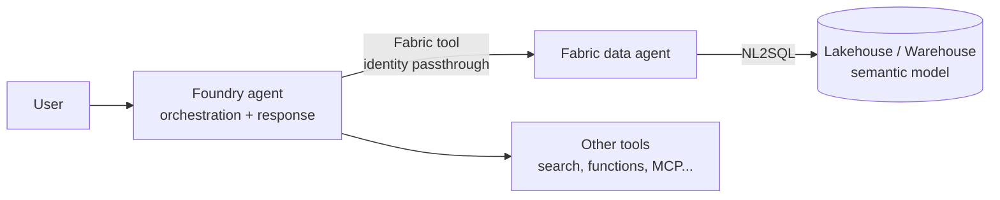

# Foundry agent over a Fabric data agent

**Goal:** put a **Foundry agent** in front of the Fabric data agent you built, so your demo has a
real conversational front end — one agent that can combine your enterprise data with other tools,
instead of a Fabric-only chat window.

**Setup time:** ~45 min · **Prerequisites:** a **published** Fabric data agent on an F2+ capacity
(see [`fabric-data-agent-synthetic-data`](../fabric-data-agent-synthetic-data/)), a Foundry project
(see [`fabric-foundry-terraform-baseline`](../fabric-foundry-terraform-baseline/)), and `az login`.

> **Preview.** The Fabric tool in Foundry Agent Service is in public preview. No SLA, and the API
> surface may still move. Good enough for a demo, not for production.

---

## How it fits together



Two things worth knowing before you build it:

- **The model you pick for the Foundry agent does orchestration and phrasing only.** It does *not*
  do the NL2SQL — the Fabric data agent does, with its own model. So a weak answer is almost always
  a Fabric-side problem (missing table descriptions), not a model problem.
- **Authentication is identity passthrough (On-Behalf-Of).** The query runs as the *signed-in user*.
  **Service principals are not supported.** Everyone who tries your demo needs at least `READ` on
  the data agent *and* read on the underlying lakehouse.

---

## 1. Collect the two GUIDs

Open your data agent in Fabric and read them straight from the URL:

```text
https://app.fabric.microsoft.com/groups/<workspace_id>/aiskills/<artifact_id>/...
```

The data agent must be **published**, not just saved. An unpublished agent returns nothing.

## 2. Create the project connection

### Option A — portal (fastest)

In the Foundry portal: open your project → create or open an agent → add the **Microsoft Fabric
data agent** tool → paste `workspace_id` and `artifact_id`. Foundry creates the connection for you.
Copy the connection **ID** shown in the tool configuration.

### Option B — script (repeatable, what you want for a hackathon)

```bash
cp .env.template .env      # fill it in
./create_connection.sh
```

It does an ARM `PUT` on the project's `connections` resource with a `CustomKeys` payload holding the
two GUIDs. You need `Microsoft.CognitiveServices/accounts/projects/connections/write` on the project.

The connection ID looks like:

```text
/subscriptions/<sub>/resourceGroups/<rg>/providers/Microsoft.CognitiveServices/accounts/<account>/projects/<project>/connections/<name>
```

## 3. Run the agent

```bash
pip install -r requirements.txt
az login          # remember: user identity, not a service principal
python prompt_agent.py "Which store is underperforming, and since when?"
```

Two flavours are provided:

| Script | What it is | Use it when |
|---|---|---|
| [`prompt_agent.py`](prompt_agent.py) | A **server-side prompt agent** created in the project via `azure-ai-projects`. Persists, visible in the portal. | You want to show the agent in the Foundry portal, or reuse it from a UI |
| [`hosted_agent.py`](hosted_agent.py) | An **ephemeral in-process agent** built with the Agent Framework `FoundryChatClient`. Nothing is persisted. | You want a script you can rerun endlessly without cleaning up |

Both read their configuration from `.env`.

---

## A demo script that works

Ask the three questions you planted in the data, in this order:

1. A **descriptive** one — "What was total revenue last quarter, by region?"
   Establishes that the numbers are real.
2. A **diagnostic** one — "Which store is underperforming, and since when?"
   This is the moment the room leans in. The answer must be unambiguous.
3. A **comparative** one — "What changed in the Garden category over the last six months?"
   Shows it is not a canned answer.

Then, only if the first three worked, show the agent combining Fabric with a second tool. Never
start with the fancy one.

---

## Golden rules

- **Publish the data agent, and test every question in Fabric first.** If it fails in Fabric, it
  fails in Foundry, with one more layer of indirection to debug.
- **Tell the agent when to use the tool.** Put it in the instructions:
  *"For any question about sales, stores, products or customers, use the Fabric tool."*
  For a scripted demo, force it with `tool_choice="required"`.
- **Same tenant, same region.** The data agent, its data sources' capacities and the Foundry project
  must be in the same tenant; a data source on a capacity in another region simply fails to query.
- **Grant access to everyone who will touch the demo**, including whoever drives the laptop.
  Identity passthrough means *your* permissions are not theirs.
- **Latency is real**: a Fabric tool call takes a few seconds. Do not fill the silence by clicking —
  say out loud what it is doing (translating the question into SQL over the lakehouse).
- **Have a fallback.** Screenshot the three answers before you present. Preview services have bad days.

## Troubleshooting

| Symptom | Cause | Fix |
|---|---|---|
| Agent answers from general knowledge, never calls the tool | No tool guidance in the instructions | Add explicit routing to the instructions, or `tool_choice="required"` |
| `403` or empty result on every question | Signed-in user lacks access to the data agent or the lakehouse | Grant `READ` on the data agent **and** read on the underlying items |
| Works for you, fails for a colleague | Identity passthrough | Same fix — it is per user, always |
| Authentication fails from a service principal or CI | Not supported for this tool | Use an interactive user identity |
| Tool call times out | Capacity paused or undersized | Resume the capacity; F2 is the floor |

## Sources

- [Use the Microsoft Fabric data agent (Foundry Agent Service)](https://learn.microsoft.com/azure/foundry/agents/how-to/tools/fabric)
- [Consume Fabric data agent from Microsoft Foundry](https://learn.microsoft.com/fabric/data-science/data-agent-foundry)
- [Fabric data agent sharing and underlying data source permissions](https://learn.microsoft.com/fabric/data-science/data-agent-sharing)
- [Create a Fabric data agent](https://learn.microsoft.com/fabric/data-science/how-to-create-data-agent)
